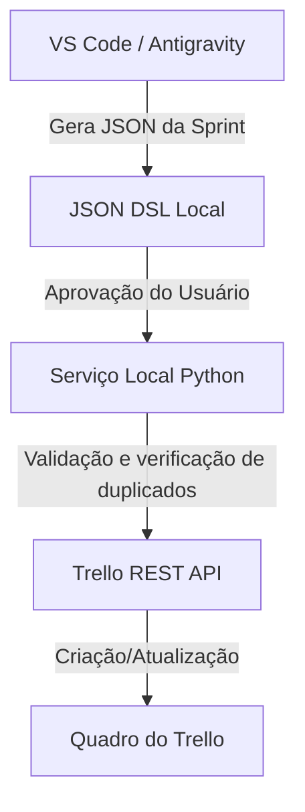

# Arquitetura de Integração do Trello

A arquitetura proposta visa simplificar a gestão de tarefas do Trello diretamente do terminal ou editor de código.

## Descrição do Fluxo

### 1. Geração (Antigravity -> JSON DSL)
O agente de IA analisa as últimas modificações do código, o backlog local ou as instruções do usuário e gera uma estrutura JSON contendo a especificação das listas, etiquetas e cartões a serem criados.

### 2. Validação e Preview
O usuário visualiza o arquivo JSON local gerado e decide se as tarefas refletem o planejamento desejado. O serviço local exibe um resumo da operação (ex: "Criando 5 cartões na lista Sprint 18, com 2 novas etiquetas").

### 3. Integração Inteligente (Idempotência)
O Serviço Local Python não cria elementos às cegas. Ele executa requisições de consulta antes de criar novos elementos para garantir que:
* Se um quadro ou lista já existir, o ID atual é reutilizado ao invés de duplicá-los.
* Se as etiquetas já estiverem configuradas com a mesma cor e nome, elas são apenas associadas ao cartão.
* Evita redundâncias na recriação de cartões já existentes.

### 4. Execução Assíncrona
A API do Trello é acessada via requisições HTTP REST diretas utilizando bibliotecas padrão do Python (como `requests` ou `urllib`). Por não exigir a interface visual do Trello, o processo de criação de dezenas de cartões e checklists leva apenas alguns segundos.
